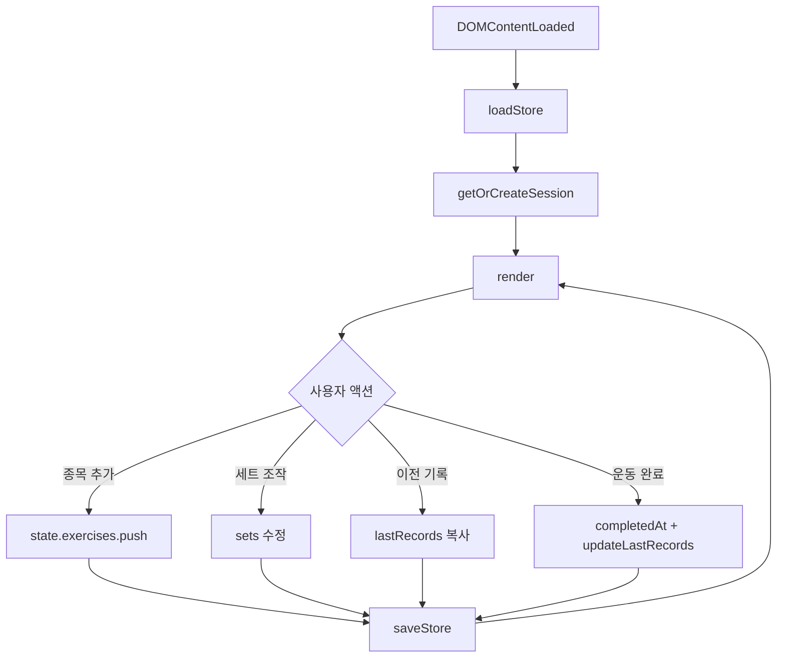

# Letaracy — 번핏 스타일 운동 기록 웹앱 구현 계획

> **승인**: 사용자 요청으로 즉시 구현 진행 (Step 1~5)

---

## index.html 구조

```
index.html
├── <head>  meta, Pretendard/DM Sans, Lucide CDN
├── <style> :root CSS 변수, 레이아웃, 컴포넌트
└── <body>
    ├── <header.app-header>     날짜, 요약(종목/세트)
    ├── <main>
    │   ├── #empty-state        종목 없을 때
    │   ├── #exercise-list      종목 카드 동적 렌더
    │   └── #week-dots          최근 7일 활동
    ├── <button#btn-add-exercise>  종목 추가
    ├── <footer.app-footer>
    │   └── #btn-complete       운동 완료
    ├── <dialog#modal-add>      종목 추가 (프리셋/직접입력)
    ├── <dialog#modal-summary>  완료 요약
    └── <div#toast>             토스트
```

---

## JS 함수 목록

| 함수 | 책임 |
|------|------|
| `loadStore()` / `saveStore()` | localStorage 읽기/쓰기 |
| `getTodayKey()` | YYYY-MM-DD |
| `getOrCreateSession()` | 오늘 세션 보장 |
| `generateId()` | exercise id |
| `escapeHtml()` | XSS 방지 |
| `calcTotalVolume()` | kg×reps 합 |
| `updateLastRecords()` | 종목별 마지막 세트 저장 |
| `render()` | 전체 UI 갱신 진입점 |
| `renderHeader()` | 날짜·요약 |
| `renderExerciseList()` | 종목 카드·세트 행 |
| `renderWeekDots()` | 7일 도트 |
| `refreshIcons()` | lucide.createIcons() |
| `handleAddExercise()` | 종목 추가 |
| `handleAddSet()` | 세트 추가 |
| `handleCopySet()` | 직전 세트 복사 |
| `handleLoadPrevious()` | lastRecords 불러오기 |
| `handleDeleteSet()` | 세트 삭제 |
| `handleToggleDone()` | 완료 토글 |
| `handleStepper()` | 중량/횟수 ± |
| `handleCompleteWorkout()` | 완료 + 요약 모달 |
| `showToast()` | 피드백 |
| `bindEvents()` | 이벤트 위임 |

---

## 데이터 스키마 (localStorage 키: `letaracy_workout`)

```json
{
  "sessions": {
    "2026-05-29": {
      "exercises": [
        { "id": "abc", "name": "벤치프레스", "sets": [{ "weight": 60, "reps": 10, "done": false }] }
      ],
      "completedAt": null
    }
  },
  "lastRecords": {
    "벤치프레스": [{ "weight": 60, "reps": 10 }]
  }
}
```

---

## 로직 흐름



---

## 구현 스텝

### Step 1 — 골격 & 디자인 시스템
- [x] `index.html` 단일 파일, viewport meta
- [x] CSS 변수(다크 팔레트), Pretendard + DM Sans
- [x] 모바일 430px 컨테이너, sticky header/footer
- [x] Lucide CDN, `refreshIcons()`

### Step 2 — 세션 & 종목 추가
- [x] 오늘 날짜 헤더
- [x] 프리셋 8종 + 직접 입력 모달
- [x] empty state

### Step 3 — 세트 관리
- [x] 세트 행: 번호 pill, 중량/횟수 stepper, 완료 체크
- [x] 세트 추가 / 삭제 / 직전 세트 복사
- [x] 완료 시 시각 피드백

### Step 4 — 영속화 & 이전 기록
- [x] localStorage 자동 저장
- [x] 새로고침 후 데이터 유지
- [x] "지난 기록 불러오기" per 종목

### Step 5 — 완료 & 7일 요약
- [x] 운동 완료 모달 (종목/세트/볼륨)
- [x] `lastRecords` 갱신
- [x] 최근 7일 도트 표시
- [x] 토스트 피드백

---

## 기능 체크리스트 (스프린트 완료 기준)

- [x] 종목 추가 (프리셋 + 직접)
- [x] 세트 중량/횟수/완료/추가/삭제/복사
- [x] stepper (5kg, 1회)
- [x] 이전 기록 불러오기
- [x] 운동 완료 요약
- [x] 7일 도트
- [x] 오프라인·localStorage
